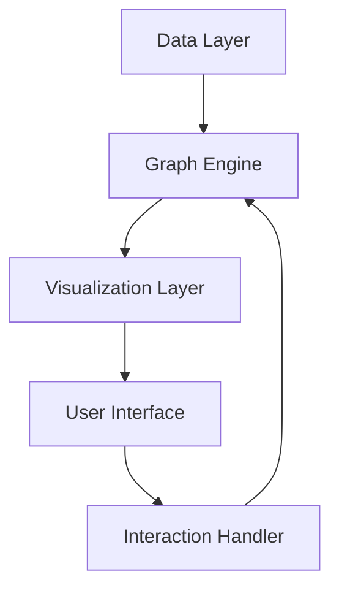

# Causal Network Visualization

An advanced visualization tool built with React and TypeScript for exploring and analyzing complex causal relationships in data. This project focuses on making complex causal networks more interpretable and interactive.

## Project Overview

### Key Features

- Interactive graph visualization
- Advanced node categorization
- Centrality analysis tools
- Custom filtering system
- Real-time graph updates

### Tech Stack

- **Frontend**: React, TypeScript, Sigma.js
- **Visualization**: D3.js, Three.js
- **State Management**: Redux
- **Data Processing**: RxJS

## Technical Architecture

### Core Components



## Features in Detail

### Graph Visualization

- Force-directed layout
- Custom node styling
- Edge weight visualization
- Hierarchical structure
- Cluster identification

### Analysis Tools

- Centrality metrics
- Path analysis
- Community detection
- Impact assessment
- Pattern recognition

### Interactive Features

- Node/edge filtering
- Subgraph selection
- Dynamic layout
- Search functionality
- History tracking

## Implementation

### Data Structure

```typescript
interface Node {
  id: string;
  type: NodeType;
  attributes: NodeAttributes;
  metrics: NodeMetrics;
}

interface Edge {
  source: string;
  target: string;
  weight: number;
  type: EdgeType;
}
```

### Visualization Techniques

- Custom WebGL shaders
- SVG rendering
- Canvas optimization
- Level-of-detail
- Smooth transitions

## Use Cases

### Research Analysis

- Causal relationship mapping
- Hypothesis testing
- Network analysis
- Pattern discovery

### Data Exploration

- Interactive exploration
- Relationship discovery
- Impact analysis
- Knowledge mapping

## Performance

### Optimization Techniques

- WebGL acceleration
- Lazy loading
- Virtual scrolling
- Worker threads
- Caching strategies

### Benchmarks

- 10k+ nodes real-time rendering
- Sub-100ms interaction response
- 60 FPS smooth animation
- Efficient memory usage

## Development

### Current Status

- Version: 2.0.0
- Stable Release
- Active Development
- Regular Updates

### Roadmap

1. Enhanced AI integration
2. 3D visualization support
3. Collaborative features
4. Advanced analytics

## Documentation

### User Guide

- [Getting Started](https://github.com/SonghaiFan/causal-graph/docs/getting-started)
- [API Reference](https://github.com/SonghaiFan/causal-graph/docs/api)
- [Examples](https://github.com/SonghaiFan/causal-graph/examples)
- [Best Practices](https://github.com/SonghaiFan/causal-graph/docs/best-practices)

### Developer Resources

- [Contributing Guide](https://github.com/SonghaiFan/causal-graph/contributing)
- [Architecture Overview](https://github.com/SonghaiFan/causal-graph/architecture)
- [Plugin Development](https://github.com/SonghaiFan/causal-graph/plugins)

## Community

### Get Involved

- [GitHub Repository](https://github.com/SonghaiFan/causal-graph)
- [Issue Tracker](https://github.com/SonghaiFan/causal-graph/issues)
- [Discussion Forum](https://github.com/SonghaiFan/causal-graph/discussions)

### Support

- Technical support
- Feature requests
- Bug reports
- Community discussions

::: tip Live Demo
Try the interactive demo at [causal-graph.demo.songhai.one](https://causal-graph.demo.songhai.one)
:::
