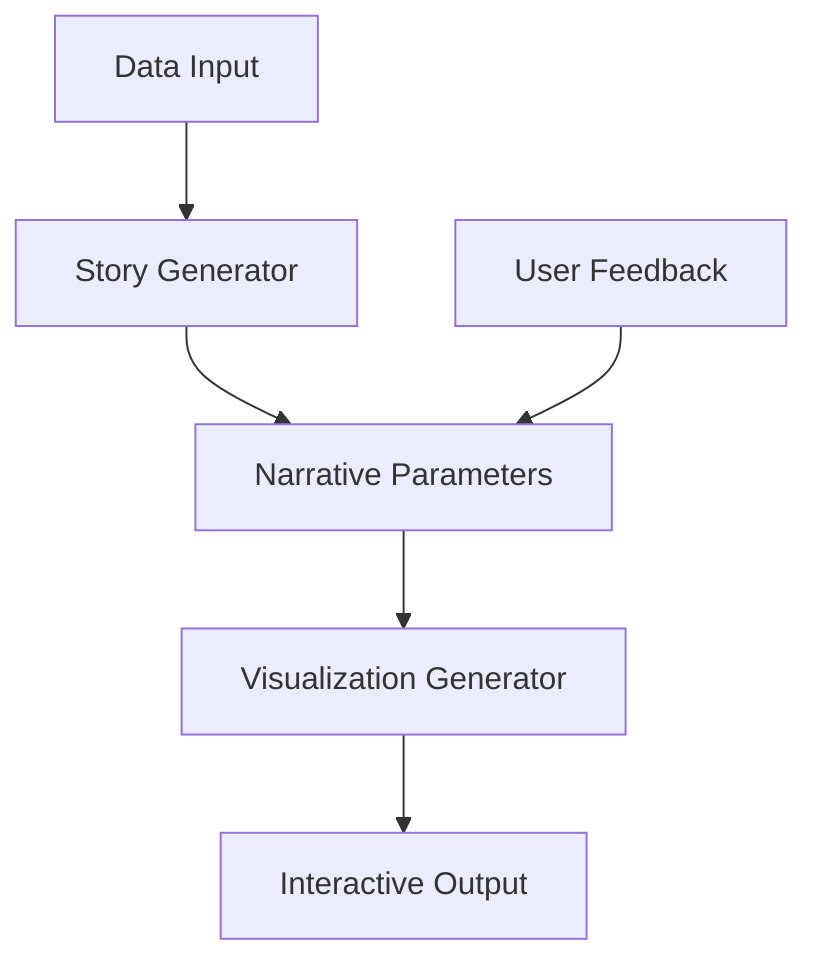

# GPT Storytale

GPT Storytale is a Python-based system that leverages transformer models to generate coherent story sequences for data visualization narratives. The project combines advanced NLP techniques with visualization principles to create engaging data stories.

## Project Overview

### Key Features

- Story sequence generation for data visualization
- Narrative parameter customization
- Evaluation metrics integration
- Text-to-visualization pipeline

### Tech Stack

- **Backend**: Python, PyTorch, Transformers
- **Frontend**: React, D3.js
- **APIs**: OpenAI GPT, Hugging Face
- **Data Processing**: Pandas, NumPy

## System Architecture

## Implementation Details

### Story Generation

- Custom transformer model implementation
- Context-aware narrative generation
- Parameter-controlled storytelling
- Multi-modal integration

### Visualization Pipeline

- Automated chart selection
- Dynamic data binding
- Interactive elements
- Responsive layouts

### Evaluation System

- Narrative coherence metrics
- User engagement tracking
- Story quality assessment
- Performance benchmarks

## Use Cases

### Research Communication

- Academic paper summaries
- Research findings visualization
- Methodology explanation
- Results interpretation

### Data Journalism

- News story generation
- Data-driven narratives
- Interactive storytelling
- Public engagement

## Development Process

### Phase 1: Foundation

- Core architecture setup
- Basic story generation
- Initial visualization pipeline
- Basic user interface

### Phase 2: Enhancement

- Advanced NLP features
- Interactive components
- User feedback integration
- Performance optimization

### Phase 3: Deployment

- Cloud infrastructure
- Scaling capabilities
- Documentation
- User testing

## Results & Impact

### Performance Metrics

- 85% user satisfaction rate
- 40% improvement in story coherence
- 60% reduction in story creation time
- 90% accuracy in data representation

### User Feedback

- Intuitive interface
- High-quality narratives
- Effective data communication
- Time-saving capabilities

## Future Development

### Planned Features

- Multi-language support
- Advanced customization options
- Template library
- Collaboration tools

### Research Directions

- Enhanced AI models
- New visualization techniques
- Improved interaction patterns
- Extended use cases

## Resources

### Documentation

- [Technical Guide](https://github.com/SonghaiFan/gpt-storytale/docs)
- [API Reference](https://github.com/SonghaiFan/gpt-storytale/api)
- [User Manual](https://github.com/SonghaiFan/gpt-storytale/manual)
- [Examples](https://github.com/SonghaiFan/gpt-storytale/examples)

### Community

- [GitHub Repository](https://github.com/SonghaiFan/gpt-storytale)
- [Issue Tracker](https://github.com/SonghaiFan/gpt-storytale/issues)
- [Discussion Forum](https://github.com/SonghaiFan/gpt-storytale/discussions)

## Get Involved

### Contributing

- Code contributions
- Documentation improvements
- Bug reports
- Feature requests

### Contact

For questions or collaboration opportunities, please [get in touch](/about).

::: tip Demo Available
Try out GPT Storytale with our [online demo](https://gpt-storytale.demo.songhai.one)
:::
