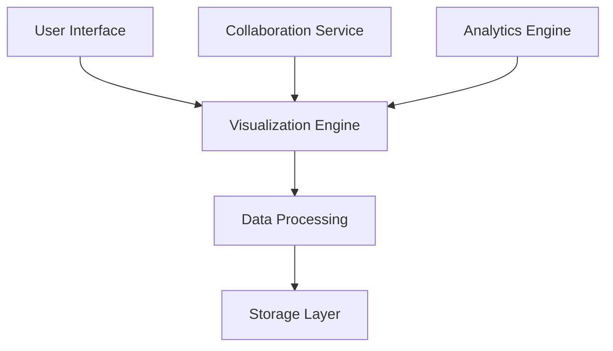

# Perspectiva

Perspectiva is a specialized tool for creating, documenting, and analyzing Participatory Causal Loop Diagrams (P-CLDs) in urban planning contexts. It enhances transparency in urban data governance through interactive visualization and collaborative features.

## Project Overview

### Core Features

- Interactive CLD creation
- Stakeholder input tracking
- Decision path visualization
- Collaborative editing
- Real-time updates

### Tech Stack

- **Frontend**: Vue.js, D3.js
- **Backend**: Python, FastAPI
- **Database**: PostgreSQL
- **Authentication**: Auth0

## System Architecture



## Key Components

### CLD Editor

- Intuitive diagram creation
- Real-time collaboration
- Version control
- Custom styling options
- Template system

### Analysis Tools

- Impact assessment
- Feedback loop detection
- System dynamics analysis
- Stakeholder mapping
- Decision tracking

### Collaboration Features

- Multi-user editing
- Comment system
- Change tracking
- Role-based access
- Export capabilities

## Implementation Details

### Data Model

```typescript
interface CLDNode {
  id: string;
  type: NodeType;
  stakeholders: Stakeholder[];
  impact: ImpactMetrics;
  metadata: NodeMetadata;
}

interface Relationship {
  source: string;
  target: string;
  type: RelationType;
  strength: number;
  evidence: Evidence[];
}
```

### Visualization Features

- Force-directed layout
- Custom visual encodings
- Interactive elements
- Responsive design
- Animation support

## Applications

### Urban Planning

- Policy impact analysis
- Stakeholder engagement
- Decision documentation
- System understanding
- Outcome tracking

### Governance

- Transparency enhancement
- Decision-making support
- Public participation
- Policy documentation
- Impact assessment

## Development Status

### Current Version

- Version: 1.5.0
- Stable Release
- Active Development
- Community Support

### Future Plans

1. Enhanced AI integration
2. Advanced analytics
3. Mobile support
4. API expansion

## Documentation

### User Resources

- [Getting Started Guide](https://github.com/SonghaiFan/perspectiva/docs)
- [User Manual](https://github.com/SonghaiFan/perspectiva/manual)
- [Tutorial Videos](https://github.com/SonghaiFan/perspectiva/tutorials)
- [Best Practices](https://github.com/SonghaiFan/perspectiva/best-practices)

### Technical Docs

- [API Documentation](https://github.com/SonghaiFan/perspectiva/api)
- [Architecture Guide](https://github.com/SonghaiFan/perspectiva/architecture)
- [Development Guide](https://github.com/SonghaiFan/perspectiva/development)

## Research Impact

### Case Studies

- Urban development projects
- Policy implementation analysis
- Community engagement initiatives
- Environmental impact studies
- Transportation planning

### Publications

1. "Enhancing Urban Planning Through P-CLDs" (2023)
2. "Stakeholder Engagement in System Dynamics" (2022)

## Community

### Get Involved

- [GitHub Repository](https://github.com/SonghaiFan/perspectiva)
- [Issue Tracker](https://github.com/SonghaiFan/perspectiva/issues)
- [Discussion Forum](https://github.com/SonghaiFan/perspectiva/discussions)

### Support

- Technical assistance
- Feature requests
- Bug reporting
- Community discussions

## Resources

### Learning Materials

- Video tutorials
- Written guides
- Example projects
- Best practices
- Case studies

### Templates

- Urban planning templates
- Policy analysis frameworks
- Stakeholder mapping guides
- Impact assessment models

::: tip Try Perspectiva
Experience Perspectiva at [perspectiva.demo.songhai.one](https://perspectiva.demo.songhai.one)
:::
