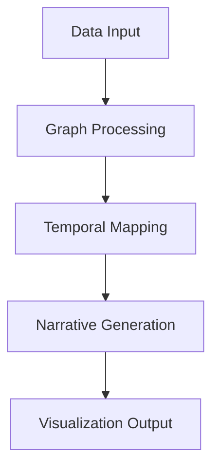

# Time-Track Narrative Graph Model (TTNG)

The Time-Track Narrative Graph Model is a novel approach to visualizing temporal narratives in data. This research project focuses on developing a comprehensive framework for representing and analyzing time-based narrative structures through graph-based visualization techniques.

## Research Overview

### Core Concepts

#### Graph Model

- Temporal node representation
- Narrative edge relationships
- Multi-dimensional connections
- Dynamic graph structures

#### Narrative Elements

- Story arc mapping
- Temporal progression
- Causal relationships
- Narrative patterns

## Technical Implementation

### Graph-to-Text Pipeline

- LLM integration for narrative generation
- Context-aware text synthesis
- Temporal coherence maintenance
- Narrative quality assessment

### Visualization Components

- Interactive timeline views
- Node-link representations
- Story path highlighting
- Dynamic filtering

## Current Research

### User Studies

- Algorithmic alignment with human understanding
- Cognitive load assessment
- Navigation pattern analysis
- Comprehension testing

### System Development

- Web-based visualization tools
- Real-time graph updates
- Interactive story creation
- Collaborative features

## Applications

### Data Storytelling

- News narrative visualization
- Historical event mapping
- Process documentation
- Educational storytelling

### Analysis Tools

- Pattern discovery
- Trend identification
- Relationship mapping
- Temporal analysis

## Technical Details

### Architecture

### Key Features

1. Temporal data integration
2. Narrative structure detection
3. Interactive visualization
4. AI-powered story generation

## Future Development

### Planned Enhancements

- Advanced AI integration
- Real-time collaboration
- Extended visualization options
- Enhanced interaction models

### Research Goals

- Improved narrative coherence
- Better user engagement
- Expanded application domains
- Enhanced scalability

## Resources

### Documentation

- [Technical Documentation](#)
- [API Reference](#)
- [User Guide](#)
- [Research Papers](#)

### Tools & Libraries

- Graph visualization frameworks
- Temporal data processors
- Narrative generation tools
- Analysis utilities

::: tip Research Progress
This project is actively developing. Check back for regular updates on new features and research findings.
:::

## Get Involved

### Collaboration Opportunities

- Algorithm development
- User interface design
- Evaluation studies
- Application development

### Contact

Interested in collaborating or learning more about TTNG? [Get in touch](/about).
